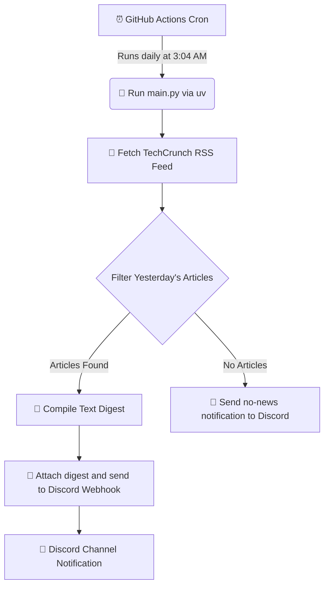

# 📰 AI News Digest

A lightweight, automated pipeline that fetches the latest AI news from **TechCrunch**, compiles it into a clean daily digest, and delivers it straight to your **Discord** channel every morning — completely hands-free. ⚡

Powered by **GitHub Actions** and **Discord Webhook**.

---

## 💡 Inspiration

Keeping up with AI news these days feels like a full-time job in itself. Every time I checked TechCrunch, there would be five new articles I had missed. So I built this tool to do the checking for me.

Now, the digest just shows up in Discord every morning. No need to go hunting for it, and the notification doubles as a nudge to actually stop and read. Each entry gives you a quick description so you can decide if it's worth your time, along with a link straight to the article. That's it. No fluff, no ads, no extra noise.

---

## 🔍 How It Works



---

## ✨ Features

- 📰 **TechCrunch AI Feed** — Parses TechCrunch's dedicated AI category for reliable, high-quality coverage.
- 📅 **Smart Date Filtering** — Captures only articles published the previous UTC day, so you never see stale news.
- 📄 **Single-file Digest** — Compiles all of yesterday's articles into one `.txt` file. Each entry includes the article's title, a brief description pulled directly from the RSS feed, and a clickable link to read the full article on TechCrunch.
- 💬 **Discord Delivery** — Sends the digest as a file attachment via a Discord Webhook.
- ⚙️ **Fully Automated** — Scheduled to run every morning with zero manual intervention.

---

## 🛠️ Tech Stack

- **Runtime:** Python `>=3.13`
- **Package Manager:** [uv](https://docs.astral.sh/uv/)
- **Key Libraries:**
  - `feedparser` — Parses the TechCrunch RSS feed.
  - `requests` — Sends the digest to Discord via HTTP POST.
  - `python-dotenv` — Loads local environment variables from `.env`.

---

## 🚀 Getting Started

### 📋 Prerequisites

Make sure you have [uv](https://docs.astral.sh/uv/getting-started/installation/) installed on your machine.

### ⚙️ Setup

1. **Clone the repository:**
   ```bash
   git clone <your-repo-url>
   cd news-fetch
   ```

2. **Create a `.env` file** in the root directory and add your Discord Webhook URL:
   ```env
   DISCORD_WEBHOOK_URL="https://discord.com/api/webhooks/YOUR_WEBHOOK_ID/YOUR_WEBHOOK_TOKEN"
   ```

3. **Install dependencies:**
   ```bash
   uv sync
   ```

4. **Run the script:**
   ```bash
   uv run main.py
   ```

---

## 🤖 GitHub Actions Automation

The workflow runs automatically every day on a cron schedule — no manual steps required.

- **Workflow file:** [`.github/workflows/cron.yml`](.github/workflows/cron.yml)
- **Schedule:** Daily at `3:04 AM` America/Toronto time.
- **Required secret:** Add a repository secret named `DISCORD_WEBHOOK_URL` under **Settings → Secrets and variables → Actions**.

---

## 📄 License

This project is open-source and available under the [MIT License](LICENSE).
